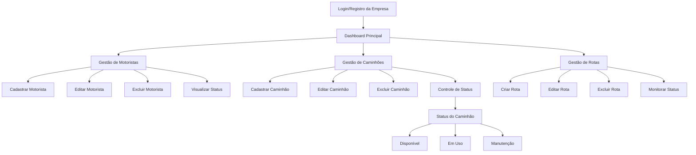

**Fluxograma do Sistema**

**Apresentação do Sistema**

1. **Introdução ao FleetMaax**
   - Sistema web para gerenciamento de frotas de caminhões
   - Desenvolvido com Laravel (PHP) e TailwindCSS
   - Interface moderna e responsiva
   - Sistema de autenticação seguro

2. **Funcionalidades Principais**

   a) **Gestão de Empresas**
   - Sistema multi-empresa
   - Cadastro com CNPJ e validações
   - Login seguro com autenticação
   - Dashboard personalizado por empresa

   b) **Gestão de Motoristas**
   - Cadastro completo de motoristas
   - Status de atividade
   - Vinculação com caminhões
   - Histórico de rotas

   c) **Gestão de Caminhões**
   - Cadastro detalhado com:
     * Implemento
     * Marca/Modelo
     * Ano
     * Número do Chassi
     * Placa (suporte a formato Mercosul e antigo)
     * Cor
     * Status operacional
   - Sistema de status com cores:
     * Verde: Disponível
     * Azul: Em Uso
     * Vermelho: Manutenção

   d) **Gestão de Rotas**
   - Criação e gerenciamento de rotas
   - Associação com motoristas e caminhões
   - Monitoramento de status
   - Histórico de viagens

3. **Características Técnicas**

   a) **Frontend**
   - TailwindCSS para estilização
   - JavaScript para interações dinâmicas
   - Modais para ações rápidas
   - Validações em tempo real
   - Interface responsiva

   b) **Backend**
   - Laravel Framework
   - Sistema MVC
   - Validações robustas
   - API RESTful
   - Banco de dados relacional

4. **Segurança**
   - Autenticação segura
   - Proteção contra CSRF
   - Validação de dados
   - Controle de acesso por empresa
   - Senhas criptografadas

5. **Diferenciais**
   - Interface intuitiva
   - Feedback visual com cores
   - Ações rápidas com modais
   - Validações em tempo real
   - Suporte a diferentes formatos de placa
   - Sistema de filtros e busca

6. **Benefícios para o Usuário**
   - Gestão centralizada da frota
   - Controle eficiente de motoristas
   - Monitoramento em tempo real
   - Redução de erros operacionais
   - Tomada de decisão facilitada
   - Histórico completo de operações

7. **Demonstração Prática**
   - Login no sistema
   - Cadastro de caminhão
   - Edição de motorista
   - Criação de rota
   - Demonstração dos status
   - Filtros e buscas

8. **Futuras Implementações**
   - App mobile
   - Rastreamento em tempo real
   - Relatórios avançados
   - Integração com APIs de mapas
   - Sistema de manutenção preventiva

Este roteiro de apresentação cobre os principais aspectos do seu sistema, destacando suas funcionalidades e benefícios. Para a apresentação, sugiro criar slides com screenshots do sistema em funcionamento e fazer uma demonstração ao vivo das principais funcionalidades.
